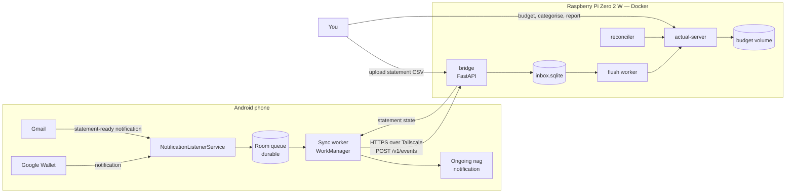
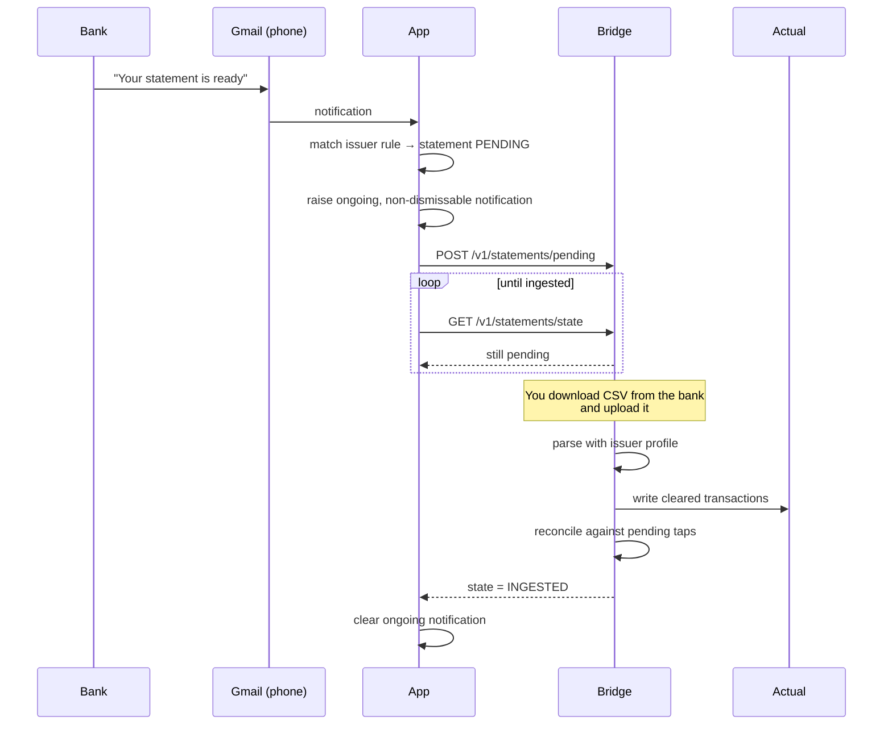

# Architecture — Aqueduct

**Status:** Draft v1 · **Last updated:** 2026-08-23
Companion to [`prd.md`](prd.md). Decisions and rejected alternatives live in
[`decisions.md`](decisions.md).

---

## 1. System context



Two things to notice:

1. **The phone never talks to Actual.** It talks only to the bridge. Actual's
   client library is heavy and version-coupled; keeping it behind the bridge
   means the app never needs to change when Actual upgrades.
2. **The bridge never blocks on Actual.** Ingest writes to a local inbox and
   returns. A separate worker does the expensive Actual session work in batches.
   That is what makes 512 MB viable — see [§4](#4-resource-budget).

## 2. Components and ownership

| Component | Tech | Lane | Purpose |
| --- | --- | --- | --- |
| `aqueduct-android` | Kotlin, Room, WorkManager | Claude | Capture, queue, review UI, nag notification |
| `aqueduct-bridge` | Python 3.12, FastAPI, `actualpy` | Claude | Ingest API, inbox, flush worker, reconciler, CSV profiles |
| `actual-server` | upstream image | You (run it) | The ledger and sync server |
| Docker / compose / volumes | — | You | Runtime, wiring, limits, restarts |
| Tailscale | — | You | Private transport between phone and Pi |
| Backups | — | You | Nightly encrypted copy + tested restore |

## 3. The data path, end to end

### 3.1 Capture

`NotificationListenerService` is bound by the system and receives
`onNotificationPosted`. For each notification:

1. **Filter** — package must be on the allowlist. Expected values:
   Google Wallet `com.google.android.apps.walletnfcrel`, Gmail
   `com.google.android.gm`. *Both must be confirmed by teach mode on the actual
   device — do not hard-code them until Spike 0.1 says so.*
2. **Drop group summaries** — `FLAG_GROUP_SUMMARY` set means it's a rollup,
   not a payment.
3. **Persist raw, immediately.** `android.title`, `android.text`,
   `android.bigText`, post time, notification key, package. This happens
   *before* parsing (FR-1) — if the parser crashes, the data survives.
4. **Normalise then parse.** Strip bidi control characters
   (U+200E, U+200F, U+202A–U+202E, U+2066–U+2069), normalise Unicode to NFC,
   collapse whitespace. Only then apply patterns.
5. **Classify** — `PARSED` / `AMBIGUOUS` / `UNPARSED`. Never guess (FR-4).

#### Why the bidi stripping matters
Hebrew notification text mixes RTL words with LTR numbers. Android renders this
with invisible directional control characters embedded *inside* the string. A
regex like `₪\s*([\d,]+\.\d{2})` will fail on text that looks identical to the
eye because there is a U+200F sitting between the symbol and the digits. This is
the single most likely cause of "it works in my test but not on the phone".

#### Parser design
Patterns live in a **versioned resource file**, not in code:

```jsonc
{
  "version": 3,
  "patterns": [
    {
      "id": "wallet.he.paid",
      "package": "com.google.android.apps.walletnfcrel",
      "field": "text",
      // authored from the real corpus in Spike 0.1 — this is a placeholder shape
      "regex": "^(?<merchant>.+?)\\s*[·—-]\\s*₪\\s*(?<amount>[\\d,]+(?:\\.\\d{1,2})?)$",
      "sign": "debit"
    }
  ]
}
```

This means the parser can be fixed by editing data and shipping a new build,
with a unit-test corpus of real strings behind it — rather than by reasoning
about Hebrew regexes in the dark.

### 3.2 Queue and delivery

Every event lands in Room with a client-generated **UUID that never changes
across retries** (FR-8). The sync worker:

- runs expedited on capture, and periodically as a safety net
- batches up to 50 events per request
- retries with exponential backoff (30s → 1m → 5m → 15m → 1h, capped)
- marks an event delivered **only** on an ack naming its UUID (FR-10)
- never drops; after 10 failures it flags the event in the UI (FR-9)

Result: airplane mode, dead Pi, flat battery, and a phone reboot are all
non-events. The queue drains when the world comes back.

### 3.3 Ingest — deliberately boring

`POST /v1/events` authenticates, validates, writes rows to `inbox.sqlite`,
returns. No Actual session, no network call, single-digit milliseconds
(FR-14). Idempotency is a `UNIQUE` constraint on `event_uuid`; a duplicate
insert is caught and reported as accepted (FR-13).

### 3.4 Flush — where the expensive work is quarantined

A worker wakes every 5 minutes. If the inbox has pending rows, it opens **one**
Actual session, writes them all as a batch, commits, and closes the session.

This matters enormously on a Pi Zero 2 W. `actualpy` works by downloading the
budget file and operating on SQLite locally. Holding that open permanently would
cost 100 MB+ of resident memory for a process that is idle 99% of the time.
Opening it for ten seconds every five minutes costs approximately nothing.

Transactions from taps are written as:

| Field | Value |
| --- | --- |
| `account` | resolved from card-last4 mapping, else the default account |
| `date` | notification post date, local timezone |
| `amount` | negative minor units (expense) |
| `payee` | raw merchant string, trimmed and length-capped |
| `cleared` | **false** — this is a prediction, not a record |
| `imported_id` | `wallet:<event_uuid>` — Actual's own dedup key |
| `notes` | `#wallet-auto` + capture timestamp |
| `category` | **unset** — Actual's Rules engine owns this (FR-17) |

### 3.5 Statement cycle



**Why detect the email on the phone instead of IMAP on the Pi?** Because we are
already building a notification listener. Reusing it means *zero new
credentials* — no Gmail app password, no OAuth flow, no mailbox access stored on
a Pi. The trade-off is that it depends on Gmail notifications being enabled for
that sender and the phone being on. Given that the fallback for a missed
statement is "you notice at the end of the month anyway", that's a good trade.
IMAP stays on the v2 list as a belt-and-braces addition. See
[D5](decisions.md#d5--statement-ready-is-detected-from-the-phones-mail-notification-not-imap).

### 3.6 Reconciliation — the core domain logic

Every transaction in Actual has one of three provenances:

- `WALLET` — from a tap. Uncleared, `imported_id = wallet:*`, `#wallet-auto`.
- `STATEMENT` — from the issuer's CSV. Cleared. **Authoritative.**
- `MANUAL` — typed in Actual by hand. Left alone entirely.

On statement ingest, for each statement row, scoped to a single account:

```
candidates = pending WALLET txns where
    amount_minor == row.amount_minor
    AND row.date >= wallet.date
    AND row.date <= wallet.date + N days      (N default 5)
    AND wallet.currency == account.currency

if len(candidates) == 0 → insert row as a new cleared transaction
if len(candidates) == 1 → MERGE
if len(candidates)  > 1 → pick nearest date only if strictly unique,
                          otherwise flag BOTH for review, merge nothing
```

**MERGE** means: keep the statement transaction as truth; if the tap's payee is
richer than the statement's (statement descriptors are often terse issuer
codes), carry it over; append the tap's note; delete the tap placeholder; write
a row to `reconciliation_log`.

Two rules that keep this honest:

- **Ambiguity never auto-resolves** (FR-25). Two ₪45.00 coffees in the same week
  is a completely normal thing to happen, and quietly picking one is how you get
  a ledger you can't trust.
- **Unmatched taps are never silently deleted** (FR-27). After 45 days a tap with
  no statement row is an *exception* — a refund, a declined payment we
  mis-captured, or a statement gap — and it gets surfaced for a human decision.

### 3.7 Statement CSV profiles

Israeli issuer exports are hostile: `windows-1255` encoding, Hebrew headers,
preamble rows before the real header, inconsistent date formats, debit-positive
sign conventions, and files named `.xls` that are actually HTML tables.

We do **not** auto-detect. Each issuer gets a declarative profile authored from a
real sample export:

```yaml
issuer: max
encoding: windows-1255          # or utf-8-sig, cp1255
format: csv                     # csv | xls | xlsx | html_table
header_row: 3                   # skip the preamble
date_format: "%d/%m/%Y"
sign_convention: debit_positive # amounts are positive for spending
columns:
  date:        "תאריך עסקה"
  merchant:    "שם בית עסק"
  amount:      "סכום חיוב"
  currency:    "מטבע"
account: "Max Credit Card"      # target Actual account
```

If a file doesn't match its profile, ingest **fails loudly** (FR-21). A
half-understood statement is worse than no statement.

## 4. Resource budget

> **Correction, 2026-08-30 — the ceiling is 463 MiB, and it was 415 MiB before
> tuning. Never 512.** The board has 512 MB, but the VideoCore firmware takes
> its split before Linux boots and the kernel reserves more on top. As shipped,
> `free -h` reported `total 415Mi` (firmware split: `arm=448M`, `gpu=64M`).
> Setting `gpu_mem=16` on this headless box moved that to `arm=496M` and
> `total 463Mi`. Roughly 50 MB of the original budget below never existed even
> after tuning. Every figure here is now stated against **463 MiB**.

Rough expectations, alongside what has actually been measured. **An estimate is
not a fact; a dash means nobody has looked yet.**

| Process | Estimated | Measured | Notes |
| --- | --- | --- | --- |
| Raspberry Pi OS Lite (64-bit, headless) | 80–120 MB | **143 MiB** | idle, post-boot, nothing else installed. **Over** the estimate |
| dockerd + containerd | 60–90 MB | **42 MiB** | comfortably under |
| `actual-server` | 120–200 MB | **48 MiB** | ⚠️ idle, empty budget, no active sync. Expect this to grow — but the estimate was out by 3–4× because the heavy budget engine really does run in *your browser*, not here |
| `aqueduct-bridge` | 50–80 MB | — | single uvicorn worker, no reload |
| `tailscaled` | 25–40 MB | — | |
| **Running total** | — | **233 MiB** | of 463 MiB. **230 MiB still `available`** |

Baseline after tuning, before Docker: **143 MiB used, 319 MiB `available`**,
zram present (462 MiB, zstd) and empty.

With Docker and `actual-server` both up and healthy: **233 MiB used, 230 MiB
`available`**, 50 MiB of zram in use.

**The conclusion the measurements force:** the estimates were wrong in both
directions, and the pessimism was misplaced. Against 230 MiB of remaining
headroom, `tailscaled` (25–40 MB) and the bridge (50–80 MB) leave roughly
110 MiB spare. The "uncomfortably close to the ceiling" worry above does not
survive contact with the hardware. What remains genuinely unknown is how
`actual-server` grows under a real budget file with active sync — that is what
the G4 soak is for, and it is the only number here still worth being nervous
about.

Mitigations, in order of importance:

1. **zram swap** — compressed in-RAM swap. Effectively free capacity for cold
   pages. Non-optional — **and now automatic**: current Raspberry Pi OS ships
   `rpi-swap`, which configures `/dev/zram0` (zstd, sized to RAM) and removes the
   SD swapfile itself. Verify with `swapon --show` and `zramctl`; the older
   `dphys-swapfile` instructions in the runbook no longer apply.
2. **Reclaim the GPU split.** On a headless box the VideoCore allocation is close
   to pure waste. **Done and measured:** `gpu_mem=16` in
   `/boot/firmware/config.txt` moved `total` from 415 MiB to 463 MiB and
   `available` from 277 MiB to 319 MiB — **+48 MiB for one line**, the cheapest
   win on the box. The KMS driver did not override it here.
3. **Batched, short-lived Actual sessions** (§3.4) — keeps the biggest transient
   allocation out of steady state.
4. **Per-container `mem_limit`** so one leak degrades one service instead of
   OOM-killing the ledger. ⚠️ **This does nothing on a stock Pi OS install.**
   Confirmed on this hardware: `/sys/fs/cgroup/cgroup.controllers` listed only
   `cpuset cpu io pids`. Docker accepts every limit and enforces none of them.
   The fix is `cgroup_enable=memory cgroup_memory=1` appended to the single line
   in `/boot/firmware/cmdline.txt`, then a reboot.

   The reason it is not simply "add it to the file" is worth knowing: the
   firmware **prepends** `cgroup_disable=memory` to the kernel command line, and
   that string appears nowhere in `cmdline.txt`. After the fix, `/proc/cmdline`
   contains both — the firmware's `cgroup_disable=memory` early, and ours late —
   and the later one wins. `cmdline.txt` is a request; `/proc/cmdline` is what
   the kernel was actually given. Verify against the latter, always.
5. **Never build images on the Pi.** Cross-build with `buildx` for `linux/arm64`,
   or pull prebuilt. A Gradle or pip build on-device will OOM.
6. **Single uvicorn worker.** Concurrency requirements here are one phone.

### If Spike 0.3 comes back tight

Work this ladder **in order**, cheapest and least-destructive first. Nothing in
the design changes at any rung — only tuning, or where containers land.

1. **Tune what's already there.** Raise the zram device size, tighten
   `mem_limit`s, strip unused host services. Most "tight" results are fixed here.
2. **Cut the flush interval's peak**, not its frequency — smaller batches mean a
   smaller transient allocation during the Actual session.
3. **Drop `tailscaled`** (~30–50 MB). Fall back to LAN-only queue-and-flush.
   This is a real cost, not a free win: you lose valid TLS (so the Android app
   needs a cleartext exception), and you lose SSH-from-anywhere. See
   [D9](decisions.md#d9--tailscale-for-transport-the-pi-is-never-internet-exposed).
4. **Move `actual-server` to another always-on machine**, keep the bridge on the Pi.
5. **Move the whole stack to a Pi 4 or similar.** Ends the conversation permanently.

**Important: measure with everything installed, including Tailscale.** A number
collected from a system missing a component doesn't describe the system being
built. Install the full stack, measure, *then* decide whether anything needs to
come out.

## 5. Data model

### 5.1 Android (Room)

```
payment_event
  id                TEXT PK      -- UUID, stable across retries
  package_name      TEXT
  notification_key  TEXT
  posted_at_utc     INTEGER
  raw_title         TEXT         -- purged after retention window
  raw_text          TEXT
  raw_big_text      TEXT
  content_hash      TEXT         -- dedup within window
  parse_status      TEXT         -- PARSED | AMBIGUOUS | UNPARSED
  parser_version    INTEGER
  amount_minor      INTEGER      -- signed, agorot
  currency          TEXT         -- ISO 4217
  merchant_raw      TEXT
  card_last4        TEXT NULL
  review_state      TEXT         -- NONE | NEEDS_REVIEW | EDITED | REJECTED
  sync_state        TEXT         -- PENDING | SENT | ACKED | FAILED
  attempt_count     INTEGER
  last_error        TEXT NULL

statement_watch
  issuer            TEXT PK
  period            TEXT         -- e.g. 2026-08
  detected_at_utc   INTEGER
  state             TEXT         -- PENDING | INGESTED | DISMISSED
  dismiss_reason    TEXT NULL
```

### 5.2 Bridge (`inbox.sqlite`)

```
inbox_event
  event_uuid    TEXT PK          -- UNIQUE == idempotency (FR-13)
  received_at   INTEGER
  payload_json  TEXT
  state         TEXT             -- PENDING | WRITTEN | FAILED | REJECTED
  actual_txn_id TEXT NULL
  attempts      INTEGER
  last_error    TEXT NULL

statement_state
  issuer TEXT, period TEXT, state TEXT, detected_at INTEGER,
  ingested_at INTEGER NULL, file_sha256 TEXT NULL,
  PRIMARY KEY (issuer, period)

reconciliation_log
  id INTEGER PK, ran_at INTEGER, issuer TEXT, period TEXT,
  statement_txn_id TEXT, wallet_event_uuid TEXT NULL,
  action TEXT,                   -- MERGED | INSERTED | FLAGGED_AMBIGUOUS | ORPHANED
  detail_json TEXT
```

`reconciliation_log` is append-only and is the audit trail. When the ledger and
the statement disagree, this is the file you read.

## 6. HTTP contract — `v1`

All endpoints require `Authorization: Bearer <token>`. Base URL is the Pi's
Tailscale name.

### `POST /v1/events`
```jsonc
{
  "device_id": "pixel-8",
  "events": [{
    "event_uuid": "0f7d…",              // idempotency key
    "captured_at": "2026-08-23T14:22:31Z",
    "source": "wallet_notification",
    "amount_minor": -4500,               // negative == expense
    "currency": "ILS",
    "merchant_raw": "קפה גרג",
    "card_last4": "4821",                // nullable
    "parse_status": "PARSED",
    "parser_version": 3,
    "raw": { "title": "…", "text": "…" } // for forensics on parse failures
  }]
}
```
**200**
```jsonc
{ "accepted": ["0f7d…"], "duplicates": [], "rejected": [] }
```
Every UUID sent appears in exactly one array. The app marks delivered only what
it sees here (FR-10).

### `GET /v1/statements/state`
```jsonc
{ "pending": [{ "issuer": "max", "period": "2026-08",
                "detected_at": "2026-08-20T06:00:00Z" }] }
```

### `POST /v1/statements/pending`
App reports a detected statement-ready email. Body: `issuer`, `period`.

### `POST /v1/statements/{issuer}/{period}/upload`
`multipart/form-data`. Parses with the issuer profile, writes cleared
transactions, runs reconciliation, sets state `INGESTED`.
**422** with a specific parse error if the file doesn't match the profile.

### `GET /healthz`
```jsonc
{
  "status": "ok",
  "inbox_pending": 0,
  "oldest_pending_age_s": null,
  "last_flush_ok_at": "2026-08-23T14:20:00Z",
  "actual_reachable": true,
  "parser_version_seen": 3
}
```
This is what the Docker healthcheck and your monitoring read (FR-28).

## 7. Security model

- **Transport.** Tailscale (WireGuard) only. The bridge binds to `127.0.0.1` and
  the tailnet interface — never `0.0.0.0` on the LAN, never a forwarded port.
  Use `tailscale cert` to get a real Let's Encrypt certificate for the
  `*.ts.net` name, so the app gets genuine TLS with no pinning gymnastics.
- **Authentication.** Long random bearer token, provisioned into the app by QR
  code, stored in Keystore-backed `EncryptedSharedPreferences` (FR-11), rotatable
  without reinstalling the app.
- **Untrusted input.** Merchant strings come from a third party via a
  notification. Length-capped, parameterised into SQL only, never shell, never
  rendered unescaped. Payload size limits and rate limits on ingest.
- **Blast radius.** This system holds a complete record of my spending. It has no
  banking credentials, cannot move money, and is not internet-reachable. That is
  the main reason `israeli-bank-scrapers` is deferred: it would require storing
  credentials that *can* move money, which is a categorically different risk.
- **Secrets.** Never in the repo. Env vars via a `.env` file that is
  `.gitignore`d, with a committed `.env.example`.
- **Backups** are as sensitive as the live data — encrypted before leaving the box.

## 8. Failure modes

| Failure | Detected by | Behaviour | Recovery |
| --- | --- | --- | --- |
| Pi off / unreachable | Sync worker retry | Events queue on phone indefinitely | Auto-drains on reconnect |
| Actual down, bridge up | Flush worker error | Inbox grows; ingest unaffected | Auto-flushes when Actual returns (FR-4/NFR-4) |
| Notification listener killed by OEM | Watchdog (FR-29) | Warning notification to owner | Re-grant access; battery exemption |
| Parse failure | `UNPARSED` status | Event kept, shown in review screen | Fix in app, or add a pattern and reprocess corpus |
| Duplicate notification | Content hash + `event_uuid` | Second copy discarded | — |
| Statement never arrives | Ongoing notification persists | Nag continues | By design |
| CSV doesn't match profile | Profile validation | **422, nothing written** | Fix profile against the real sample |
| Ambiguous match | Reconciler | Both flagged, nothing merged | Human decides in Actual |
| SD card dies | — | Total loss without backups | NFR-6 restore from encrypted backup |

The pattern throughout: **fail loudly, keep the data, never guess.** In a
financial ledger, a silent wrong answer is much worse than a visible gap.

## 9. Testing strategy

| Layer | What | Why it's the right place |
| --- | --- | --- |
| Parser unit tests | Real captured Hebrew strings from teach mode, as a committed corpus | The highest-risk component, and cheaply testable off-device |
| Reconciler unit tests | Synthetic statement/tap pairs: exact match, near-date, duplicate amounts, FX, orphans | The core domain logic — must be provably right |
| CSV profile tests | One redacted sample file per issuer | Guards against encoding regressions |
| Bridge API tests | Idempotency, auth rejection, inbox durability | Contract with the phone |
| Integration | Bridge against a real `actual-server` in CI | Catches `actualpy` version drift (R2) |
| Manual on-device | Capture, battery survival, nag lifecycle | Cannot be automated meaningfully |
| Soak | 7-day run on the Pi watching RSS and inbox depth | Retires R3 (NFR-1) |

**The parser corpus is the most valuable test asset in the project.** It is the
one thing that cannot be reconstructed from first principles.

## 10. Build and distribution

You should never install Android Studio. GitHub Actions builds the APK:

- push to the branch → Gradle assembles a signed release APK
- APK attached to the workflow run and to a tagged release
- you download it on the phone and sideload

Signing key is generated once, held as a repository secret, and backed up
separately — losing it means uninstall-and-reinstall to upgrade.

## 11. Repository layout

```
android/                 Kotlin app (Claude)
  app/src/main/…
  app/src/test/…         parser corpus tests
bridge/                  Python service (Claude)
  aqueduct/
    api.py               FastAPI routes
    inbox.py             durable inbox
    flush.py             batch writer → Actual
    reconcile.py         matching algorithm
    profiles/            per-issuer CSV profiles (YAML)
  tests/
deploy/                  YOUR lane
  docker-compose.yml
  .env.example
  backup/
docs/
.github/workflows/
```

`deploy/` is yours. Nothing in `android/` or `bridge/` will assume anything about
it beyond the contract below.

## 12. Rollout order

Each phase leaves a working system. No phase depends on a later one.

| Phase | Delivers | Value on its own |
| --- | --- | --- |
| 0 | Spikes | Retires R1–R3 before real cost is sunk |
| 1 | Pi + Actual + Tailscale | A working self-hosted budget with manual entry |
| 2 | Teach-mode app | The parser corpus — the thing nothing else can substitute for |
| 3 | Capture + ingest + flush | **The core promise: taps land in Actual automatically** |
| 4 | Statement detection + nag | You stop forgetting to import |
| 5 | CSV ingest + reconciliation | The ledger becomes bank-accurate |
| 6 | Hardening, backups, watchdog | You can trust it unattended |

## 13. Ops contract — the seam between lanes

**This section is the interface between the two lanes.** Everything you need to
write `docker-compose.yml` without reading a line of Python is here. If you need
something not on this list, that's a bug in this document — tell me and I'll fix
the contract rather than you working around it.

### `aqueduct-bridge`

| | |
| --- | --- |
| **Image** | built by CI for `linux/arm64`, published to GHCR |
| **Ports** | `8080/tcp` — bind to loopback + tailnet only, e.g. `127.0.0.1:8080:8080` |
| **Healthcheck** | `GET /healthz` → 200 when healthy. Suggested: 30s interval, 5s timeout, 3 retries, 60s start period |
| **Volumes** | `/data` — read-write, holds `inbox.sqlite`, uploaded statement files, logs. **Must be backed up.** |
| **Memory limit** | suggested `mem_limit: 128m` |
| **Restart** | `unless-stopped` |
| **Depends on** | `actual-server` (start order only; the bridge tolerates Actual being down) |

Environment variables:

| Variable | Required | Default | Meaning |
| --- | --- | --- | --- |
| `AQUEDUCT_TOKEN` | yes | — | Bearer token the phone presents. Long and random. |
| `ACTUAL_SERVER_URL` | yes | — | e.g. `http://actual-server:5006` |
| `ACTUAL_PASSWORD` | yes | — | Actual server password |
| `ACTUAL_BUDGET_SYNC_ID` | yes | — | Budget file sync ID, from Actual's settings |
| `ACTUAL_ENCRYPTION_PASSWORD` | if E2E encryption on | — | |
| `AQUEDUCT_DEFAULT_ACCOUNT` | yes | — | Actual account name for taps with no card mapping |
| `AQUEDUCT_CARD_MAP` | no | `{}` | JSON, e.g. `{"4821":"Max Credit Card"}` |
| `AQUEDUCT_FLUSH_INTERVAL_S` | no | `300` | Batch writer interval |
| `AQUEDUCT_MATCH_WINDOW_DAYS` | no | `5` | Reconciliation date window (N) |
| `AQUEDUCT_ORPHAN_AGE_DAYS` | no | `45` | When an unmatched tap becomes an exception |
| `AQUEDUCT_DATA_DIR` | no | `/data` | |
| `TZ` | yes | — | `Asia/Jerusalem` — affects transaction dates |

### `actual-server`

Upstream image; `linux/arm64` supported. Needs one persistent volume for budget
data (**the thing that must never be lost**), port `5006`, and a password. Not
published beyond the tailnet.

### What you own operationally

Pi OS 64-bit Lite · zram · Docker + compose · volume placement (see below) ·
Tailscale on Pi and phone · `tailscale cert` for TLS · nightly encrypted backup
of both volumes off-box · **a restore you have actually performed** · image
updates (pinned tags, not `latest`) · watching `/healthz`.

Step-by-step checkpoints with verification commands are in
[`ops-runbook.md`](ops-runbook.md).

**On storage (R6):** USB SSD has far better write endurance, but a Zero 2 W has a
single micro-USB data port and a tight power budget, so it needs an OTG adapter
and realistically a powered hub. On this hardware a quality A2 / high-endurance
microSD plus a genuinely tested backup is the better trade while learning — card
wear is a slow risk, a missing backup is an instant one. Revisit on a hardware
upgrade.

### What you must never do

Build images on the Pi (OOM) · expose either service to the public internet ·
run `latest` unpinned in production · trust an untested backup.
